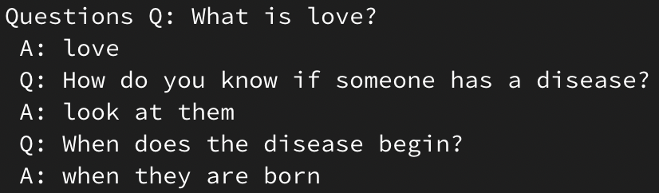

# Install and Use CTRL on Google Compute Engine



Scripts + guides on how to set up a virtual machine on [Google Compute Engine](https://cloud.google.com/compute/) capable of running and using [Salesforce](https://www.salesforce.com)'s very large text-generating model [CTRL](https://github.com/salesforce/ctrl) to generate high-quality text based on conditional parameters.

The CTRL model is so large (12 GB on disk, 15.5 GB GPU VRAM when loaded, even more system RAM during runtime) that it will currently not fit into a free Colaboratory or Kaggle Notebook. Therefore, this setup is necessary to play with the model for now.

## Machine Setup Instructions

The VM these instructions create is the minimum, lowest-cost configuration powerful enough to run CTRL without going out-of-memory (P100 GPU, 8 vCPU, 30 GB RAM, preemptible). With this configuration, having the VM up will cost **$0.51/hr**.

1. Make sure the `gcloud` command line tool is [set up](https://cloud.google.com/sdk/gcloud/) on your local computer and up-to-date (can update via `gcloud components update`).
2. Make sure your Google Cloud Platform project tied to your local computer's `gcloud` has enough [quota](https://console.cloud.google.com/iam-admin/quotas) in the `us-central-1` region (8 CPUs and 1 P100; these should be available by default, but request more quota if they aren't)
3. Make sure your GCE project has billing set up.
4. On your local computer, run this `gcloud` command in a terminal which creates a VM with the specs noted above:

```sh
gcloud compute instances create ctrl \
  --zone us-central1-c \
  --boot-disk-size 45GB \
  --image-family tf-latest-gpu \
  --image-project deeplearning-platform-release \
  --maintenance-policy TERMINATE \
  --machine-type n1-standard-8 \
  --metadata install-nvidia-driver=True \
  --preemptible \
  --accelerator='type=nvidia-tesla-p100,count=1'
  
```

You can view the created instance, Start/Stop it, and delete it, in the [Google Compute Engine](https://console.cloud.google.com/compute/instances) dashboard.

Once created (after waiting a bit for the GPU drivers to install), SSH into the instance. The recommended way to do is via the `gcloud` command created from the SSH dropdown in the GCE dashboard, which will look like:

```sh
gcloud beta compute --project "<PROJECT ID>" ssh --zone "us-central1-c" "ctrl"
```

While SSHed into the VM you created, download and run the `install_gce.sh` [script](https://github.com/minimaxir/ctrl-gce/blob/master/install_gce.sh) from this repo via:

```sh
curl -O -s https://raw.githubusercontent.com/minimaxir/ctrl-gce/master/install_gce.sh
sudo sh install_gce.sh
```

If you'd like to use the model with a sequence length of 512, you can pass `512` as an argument to the install script, e.g.

```sh
sudo sh install_gce.sh 512
```

You're done! Make sure to Stop the instance in the GCE dashboard when you are finished generating text!

## Using CTRL

For basic usage, running the command below in the VM will load the model and eventually start an interactive prompt.

```sh
sudo python generation.py --model_dir seqlen256_v1.ckpt/
```

If you are using the 512-length model, instead you would do:

```sh
sudo python generation.py --model_dir seqlen512_v1.ckpt/ --generate_num 512
```

While generating, you can specify a KeyboardInterrupt to stop generation (Ctrl+C on macOS). It's also recommended to clear the terminal (CMD+K on macOS) occasionally as the entire generated text will be output after each added token.

You **must** include a control code with each interactive prompt. You can see how the control codes are used in the original paper, or refer to the following examples:

### Links

The `Links` control code allows you to specify a URL and/or a prompt text and have the model attempt to extrapolate the corresponding article. Examples:

`Links https://www.buzzfeednews.com/article/annehelenpetersen/jeremy-renner-app-trolling-career-hurt-locker-avengers`

```
The actor who played the villain Loki in Avengers: Infinity War has been accused of being a troll. 
 
Actor Jeremy Renner was criticized for his role as Loki, an antagonist from Marvel's upcoming Avengers movie, after he tweeted that fans should "stop trying to make me look bad." 
 
In response to Renner's tweet, many people on Twitter said they were offended by what they perceived as trolling.
```

`Links https://www.nytimes.com/2020/08/29/us/politics/skynet-ai-online-norad.html`

```
Site Mobile Navigation 
 
A New Online Course for the Super-Smart 
 
The University of Washington is offering a new online course on artificial intelligence that will be taught by an expert in machine learning and neural networks. 
 
The course, called “Skynet,” was developed with help from Google, Facebook, Microsoft and other companies. It has been designed to teach students how to use deep learning, which uses computer programs modeled after neurons to analyze large amounts of data — like images or videos — using only basic rules about what each pixel represents. 
 
In addition to teaching them how to build their own programs, it also teaches them how to apply those algorithms to real-world problems. 
```

### Questions

The `Questions` control code allows you to specify a question; CTRL will attempt to follow up from that question (your mileage will vary). Examples:

`Questions Q: Who is the Zodiac Killer?`

```
A: charles manson 
```

`Questions Q: What is the last digit of pi?`

```
A: 0
```

### Reddit Subreddits

Each Reddit subreddit has a different control code; see the [bottom of the paper](https://einstein.ai/presentations/ctrl.pdf) for a full list. You can optionally specify the Title or the self-post Text body. Examples:

`Legal Title: [FL] Is it legal to get into legal trouble?`

```
Text: I was driving home from work and saw a police car pull up behind me. The officer asked me for my license and registration. He then proceeded to ask if i had any drugs in the car. 
 
My question is this: 
 
1. Can you be arrested without probable cause or even being charged with anything at all? 
 
2. If so, what are your chances of getting out of this situation? 
 
3. What happens when they arrest you? 
 
4. How do you go about proving that there were no drugs? 
 
5. Do you have an attorney who can help me? 
 
Thanks 
 
Edit: 
 
Thank you all so much for your responses. This has been very helpful as I'm trying to figure out how best to proceed. 
```

`Opinion Text: Recycling is bad for the world.`

```
It takes a lot of energy to recycle and it creates more waste than it saves. 
 
I think that recycling should be banned because we are destroying our planet with it. 
 
Edit: Thanks everyone who has given me some good arguments against recycling. 
 
Edit 2: I'm not saying that people shouldn't recycle; it's just that they need to do so in an environmentally friendly way.
```

### Amazon Reviews

The `Reviews` tag can be used to generate Amazon reviews at an optional specified rating or starting text.

`Reviews Rating: 1.0`

```
I bought this book because it was recommended by a friend. It is not worth the money. The author has no credentials and his writing style is very poor.
```

`Reviews Rating: 5.0`

```
I died a little inside when I saw the first page of this book. It was so beautiful and it made me feel like I could do anything. But then I read on to see what happened next. And there were no more pages. The book just stopped. No epilogue, nothing. Just an abrupt ending. I'm not sure if it's because there's another one coming out or what, but that's how I feel. It's almost as though she got tired of writing about her life in New York City and decided that she'd write something else instead.
```

### Command Line Arguments

Unlike other text-generating apps, CTRL has a default `temperature` of 0, meaning the model chooses the best guess when possible (before repetition `penalty` is applied). Some CLI arguments you can add:

* `--generate_num` — Number of tokens to generate (default: 256, can exceed the model window)
* `--temperature` — Controls model creativity (default: 0, may want to increase to 0.2)
* `--nucleus` — Controls cutoff for nucleus/top-*p* sampling (default: 0, may want to set to 0.9)
* `--topk` — Controls cutoff for top-*k* sampling (default: 0)
* `--penalty` — Repetition penalty factor (default: 1.2)

## Notes

* Since the model is huge, generation is *very* slow: about 2 tokens per second with the configuration above. (therefore, it takes about 2 minutes for a full generation with default parameters)
* The BPEs CTRL uses are "longer" that those used in GPT-2. As a result, a 256-token generation in CTRL is about the same decoded length as a 1024-token generation in GPT-2.
* When using the `Links` control code, keep in mind that code is conditioned on [OpenWebText](https://github.com/jcpeterson/openwebtext), which is conditioned on Reddit data. Therefore, there's a bias toward English websites and Reddit-friendly content. [Here's a quick spreadsheet](https://docs.google.com/spreadsheets/d/1O3_1RTnGn_ozcvf6eDLpsmf8ElxIqHg0FKbVfDxGS88/edit?usp=sharing) of the most popular domains on Reddit, sans some obvious image-oriented websites.
* If CTRL gets confused by the `Links` URL, it tends to fall back to a more general news-oriented output.
* It is recommended to use Google Compute Engine (even if you aren't following this guide) as the model itself is hosted in Google Cloud Storage and thus it's relatively fast to transfer to a VM (>100 Mb/s), and also lowers the cost for Salesforce.

## TODO

* Support/Test domain detection.

## Maintainer/Creator

Max Woolf ([@minimaxir](https://minimaxir.com))

*Max's open-source projects are supported by his [Patreon](https://www.patreon.com/minimaxir). If you found this project helpful, any monetary contributions to the Patreon are appreciated and will be put to good creative use.*

## Special Thanks

[Adam King](https://twitter.com/AdamDanielKing) for identifying a working implementation of loading the model after unexplained setbacks.

## License

MIT

## Disclaimer

This repo has no affiliation or relationship with the CTRL team and/or Salesforce.
